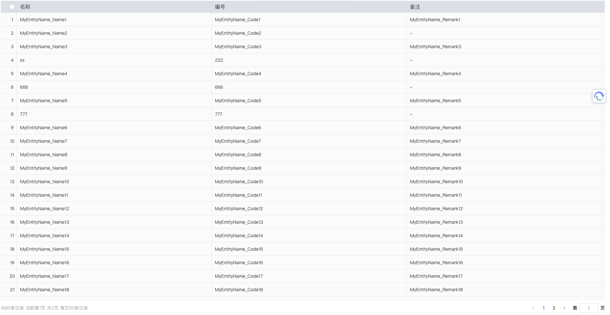

抱歉，以下是您提供的组件代码的文档：

# Table 组件

## 描述

该组件用于展示数据表格，并提供了一系列功能，包括拖拽、分页、排序、右键菜单等。

## 使用示例

#### 由于 vitepress 的表格样式问题，导致组件表格样式冲突，这里就展示表格示例了，我截图放上去



<!--
::: raw
<Layout>

<div class="vp-raw">
  <Table
    ref="tableRef"
    v-model:dataSource="dataSource"
    id='name'
    max-height="300"
    height="auto"
    :columns="columns"
    :contextMenu="contextMenu"
    :isSort="true"
    :isDrag="true"
    :isCheck="true">
  </Table>
</div>
</Layout>
::: -->
<script setup>
import { ref } from 'vue'
import Table from '@/components/Table/Table.tsx'
const tableRef = ref()
const dataSource = ref([
  {
    name: '张三',
    age: 18,
    sex: '男',
  },
  {
    name: '李四',
    age: 19,
    sex: '男',
  }
])
const columns = [{
  title: '序号',
  field: 'seq',
  type: 'seq'
},{
  title: '姓名',
  field: 'name',
},
{
  title: '年龄',
  field: 'age',
},
{
  title: '性别',
  field: 'sex',
}]
const selectedItems = ref([])
const contextMenu = [
  {
    label: '详情',
    fn: (c) => {},
    divided: true,
    icon: 'o',
  },
  {
    label: '删除',
    fn: async (c) => {},
    icon: 'close',
  },
]

</script>

```vue
<template>
  <template>
    <Table
      ref="tableRef"
      v-model:dataSource="dataSource"
      id="name"
      :columns="columns"
      :contextMenu="contextMenu"
      :isSort="true"
    >
    </Table>
  </template>

  <script setup>
    import { ref } from 'vue'
    import Table from '@/components/Table/Table.tsx'
    const tableRef = ref()
    const dataSource = ref([
      {
        name: '张三',
        age: 18,
        sex: '男',
      },
      {
        name: '李四',
        age: 19,
        sex: '男',
      },
    ])
    const columns = [
      {
        title: '序号',
        field: 'seq',
        type: 'seq',
      },
      {
        title: '姓名',
        field: 'name',
      },
      {
        title: '年龄',
        field: 'age',
      },
      {
        title: '性别',
        field: 'sex',
      },
    ]
    const selectedItems = ref([])
    const contextMenu = [
      {
        label: '详情',
        fn: (c) => {},
        divided: true,
        icon: 'o',
      },
      {
        label: '删除',
        fn: async (c) => {},
        icon: 'close',
      },
    ]
  </script>
</template>
```

以下是接口的文档：

## ParamsItem 接口

用于描述表格请求参数的数据结构。

| 字段名         | 类型             | 描述             |
| -------------- | ---------------- | ---------------- |
| Sorting        | string           | 排序字段         |
| SkipCount      | string \| number | 跳过的记录数     |
| MaxResultCount | number           | 返回的最大记录数 |
| 其他字段       | any              | 其他自定义参数   |

## ColumnType 接口

用于描述表格列的数据结构。

| 字段名   | 类型             | 描述           |
| -------- | ---------------- | -------------- |
| title    | string           | 列标题         |
| field    | string           | 列字段名       |
| width    | string \| number | 列宽度         |
| sortable | boolean          | 是否可排序     |
| required | boolean          | 是否必填       |
| 其他字段 | any              | 其他自定义参数 |

## TablePropsItemType 接口

用于描述表格组件的属性。

| 字段名            | 类型              | 默认值 | 描述                 |
| ----------------- | ----------------- | ------ | -------------------- |
| selections        | string[]          | -      | 预选中项的 id 数组   |
| autoFirstClickRow | boolean           | false  | 是否自动选中第一行   |
| params            | ParamsItem        | -      | 请求参数             |
| dataSource        | any[]             | []     | 数据源               |
| columns           | ColumnType[]      | []     | 列配置项             |
| pageSize          | number            | -      | 每页条数             |
| total             | number            | -      | 总条数               |
| isHidePagination  | boolean           | false  | 是否隐藏分页         |
| isChecked         | boolean           | -      | 是否多选             |
| isSeq             | boolean           | -      | 是否显示序号         |
| isSort            | boolean           | -      | 是否排序             |
| id                | string            | -      | 数据项的唯一标识字段 |
| showDarg          | boolean \| string | false  | 是否出现拖拽         |
| isDrag            | boolean \| string | -      | 是否拖拽             |
| disabledDrag      | boolean           | -      | 是否禁用拖拽         |
| height            | string            | -      | 表格高度             |
| maxHeight         | string            | -      | 表格最大高度         |
| isVScroll         | boolean           | -      | 是否开启虚拟滚动     |
| border            | string \| any     | -      | 边框样式             |
| url               | string            | -      | 数据请求地址         |
| sortUrlTpl        | string            | -      | 排序请求地址模板     |
| isFooter          | boolean           | -      | 是否显示底部         |
| gt                | number            | -      | -                    |
| contextMenu       | Object[]          | -      | 右键菜单项数组       |
| rowConfig         | any               | -      | 行配置项             |
| size              | string            | -      | 表格尺寸             |
| isStop            | boolean           | -      | 是否阻止冒泡         |
| 其他字段          | any               | -      | 其他自定义参数       |

## MenuOptionType 接口

用于描述右键菜单选项的数据结构。

| 字段名   | 类型   | 描述     |
| -------- | ------ | -------- |
| zIndex   | number | 层级     |
| minWidth | number | 最小宽度 |
| x        | number | X 轴坐标 |
| y        | number | Y 轴坐标 |

## contextMenuItemType 接口

用于描述右键菜单的状态数据结构。

| 字段名  | 类型                        | 描述               |
| ------- | --------------------------- | ------------------ |
| show    | boolean                     | 是否显示右键菜单   |
| current | Record<string, any> \| null | 当前右键菜单项数据 |
| options | any                         | 菜单选项           |

## 事件

| 事件名            | 参数                    | 描述                 |
| ----------------- | ----------------------- | -------------------- |
| drag              | newIndex, oldIndex, row | 拖拽排序事件         |
| check             | records                 | 选择事件             |
| sort              | row                     | 排序改变事件         |
| page              | current                 | 分页改变事件         |
| rowClick          | tableData               | 行点击事件           |
| update:dataSource | dataSource              | 更新数据源事件       |
| clickFooter       | -                       | 点击底部添加按钮事件 |
| update            | exposeMap               | 更新暴露方法事件     |
| load              | -                       | 加载完成事件         |
| beforeLoad        | -                       | 加载前事件           |
| reload            | -                       | 重新加载事件         |
| update:total      | total                   | 更新总数事件         |
